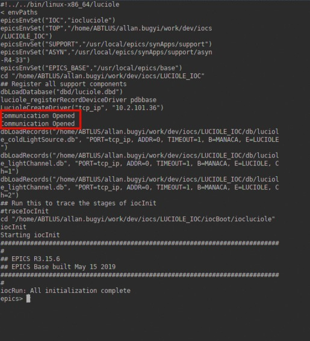

ARINAX LUCIOLE'S EPICS IOC
=============================
Brazilian Synchrotron National Light Laboratory - Campinas, 05/21/2019

Author:     Allan S. B. Bugyi. 
Contact:    allan.bugyi@lnls.br

Dependencies
============

- EPICS Base >= 3.15.6;
- SynApps 6.0;
- C and C++ compilers;
- Make;
- Asyn (AsynPortDriver) module from SynApps;
- Luciole's libraries (located under directory 'lib/' of this IOC. Must be installed in appropriate system location, e.g., directory '/usr/lib/x86_64-linux-gnu/' for a Linux 64 bits).

PVs of interest
===============

MANACA:LUCIOLE:LIGHT_CH1						Use this PV to change the light value from channel 1 - 0<=Valid range<=20000

MANACA:LUCIOLE:LIGHT_CH2						Use this PV to change the light value from channel 2 - 0<=Valid range<=20000

MANACA:LUCIOLE:ERROR								Check for errors in this PV

MANACA:LUCIOLE:CONNECTION_STATE		Assure the IOC is successfully connected to the device

MANACA:LUCIOLE:SETTRIGGER_CH1

MANACA:LUCIOLE:SETTRIGGER_CH2

MANACA:LUCIOLE:TRIGGER_MODE_CH1

MANACA:LUCIOLE:TRIGGER_MODE_CH2

Known problems
==============

For some unknown reason, the API provided by Arinax struggles every now and then to connect to the device (an ERROR message will be displayed at initializtion of the IOC, in this case). 
Simply restart the IOC, till you get 2 confirmations of connection, like below:

